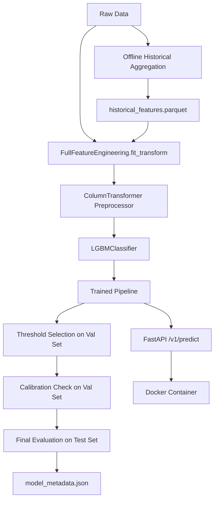

# Loan Default Risk Prediction

> **Disclaimer**: This is a machine learning engineering portfolio project, not a production
> credit-decisioning system. It uses the publicly available Home Credit Default Risk dataset
> (Kaggle, 2018) for demonstration purposes only.

A **production-grade, end-to-end ML system** that predicts the probability a loan applicant
will default — covering data pipelines, leakage-free feature engineering, model evaluation,
probability calibration, threshold selection, SHAP explainability, a FastAPI inference service,
Docker deployment, and CI/CD automation.

---

## Results

| Metric | Value |
|---|---|
| **ROC-AUC** | **0.7720** |
| PR-AUC | 0.2561 |
| Brier Score | 0.0671 |
| F1 (at selected threshold) | 0.3280 |
| Recall | 0.4549 |
| Precision | 0.2565 |
| Classification Threshold | 0.1479 (F1-optimal on validation) |
| Calibration | None applied (Brier improvement < 1%) |

*Metrics computed on a held-out 15% test set (46,127 rows), evaluated exactly once.*
*Source of truth: `models/model_metadata.json`*

---

## Why Loan Default Prediction Matters

Banks and fintech lenders extend credit to millions of people who lack conventional
credit history. Rejecting everyone who "looks risky" loses revenue and excludes
creditworthy borrowers; accepting everyone leads to catastrophic loss rates.

A well-calibrated, interpretable ML model can:
- **Quantify risk** per applicant with a calibrated probability (not a binary "yes/no").
- **Explain decisions** — regulators and customers have a right to understand why a loan was declined.
- **Optimise business tradeoffs** — the decision threshold is a business lever, not a fixed technical constant.

The asymmetry is key:
- A **false negative** (missed default): the bank lends money that won't be repaid — full credit loss.
- A **false positive** (wrongly rejected): a legitimate borrower is turned away — lost interest income.

These costs are not equal. That's why **threshold selection** and **PR-AUC** matter more than raw accuracy.

---

## Dataset

**Source**: [Home Credit Default Risk](https://www.kaggle.com/c/home-credit-default-risk) (Kaggle, 2018)

| Table | Rows | Columns | Description |
|---|---|---|---|
| `application_train.csv` | 307,511 | 122 | Main application features + target |
| `bureau.csv` | 1.7M | 17 | Credit bureau history |
| `bureau_balance.csv` | 27M | 3 | Monthly bureau snapshots |
| `previous_application.csv` | 1.7M | 37 | Prior Home Credit applications |
| `installments_payments.csv` | 13.6M | 8 | Instalment payment history |
| `POS_CASH_balance.csv` | 10M | 8 | POS/cash loan monthly balance |
| `credit_card_balance.csv` | 3.8M | 23 | Credit card monthly balance |

**Target**: `TARGET` — 1 if client had payment difficulties, 0 otherwise.
**Class imbalance**: ~8.1% positive rate.

---

## Architecture



### Pipeline Contract

```
TRAIN:     application_train → FullFeatureEngineering.fit_transform()
                              → ColumnTransformer.fit_transform()
                              → LGBMClassifier.fit()

VALIDATE:  application_val   → FullFeatureEngineering.transform()   ← same fitted instance
                              → ColumnTransformer.transform()
                              → LGBMClassifier.predict_proba()
                              → threshold selection
                              → calibration evaluation

TEST:      application_test  → FullFeatureEngineering.transform()   ← same fitted instance
                              → ColumnTransformer.transform()
                              → LGBMClassifier.predict_proba()
                              → FINAL metrics (evaluated once only)

INFERENCE: HTTP request      → FullFeatureEngineering.transform()   ← from serialized pipeline
                              → ColumnTransformer.transform()
                              → LGBMClassifier.predict_proba()
```

---

## Feature Engineering

### Application Table Features (deterministic, no statistics from data)

| Feature | Description |
|---|---|
| `PAYMENT_RATE` | Annuity / Credit Amount — measures loan burden |
| `CREDIT_INCOME_PERCENT` | Credit Amount / Income — affordability ratio |
| `ANNUITY_INCOME_PERCENT` | Annuity / Income — monthly payment burden |
| `YEARS_BIRTH` | Age in years from `DAYS_BIRTH` |
| `EXT_SOURCE_PRODUCT` | EXT_SOURCE_1 × EXT_SOURCE_2 × EXT_SOURCE_3 — interaction |
| `DAYS_EMPLOYED_ANOMALY` | Binary flag for the sentinel value 365243 in `DAYS_EMPLOYED` |
| Quantile bins | Income, Credit, Goods Price, Annuity binned into 5 groups |

### Historical Feature Aggregation (offline, cached)

Six historical tables are aggregated at `SK_ID_CURR` level and cached as Parquet.
This happens **once offline**, not during model inference.

Key features:
- Bureau: credit recency, outstanding debt, overdue amounts
- Instalment payments: payment completeness ratio, instalment shortfalls
- POS/Credit Card: days-past-due, utilisation

### Leakage Prevention

| Transformation | Old (Leaky) | Fixed |
|---|---|---|
| `pd.qcut()` in `transform()` | Recomputes bins from test/inference data | Bins computed in `fit()`, applied with `pd.cut()` |
| `SimpleImputer` in historical funcs | Fresh imputer per call | Imputer fitted once on full historical tables |
| CSV loading in `transform()` | Reads GBs per API call | Pre-computed Parquet cache loaded once |
| Feature selection | Static JSON from notebook | JSON files from validation-set selection |

---

## Model Selection

```
Logistic Regression  →  ROC-AUC ≈ 0.67  [baseline]
Random Forest        →  ROC-AUC ≈ 0.72  [+5pp vs LR]
LightGBM (tuned)     →  ROC-AUC ≈ 0.77  [+5pp vs RF, selected]
```

**Why LightGBM**:
- Best ROC-AUC and PR-AUC across all evaluation metrics
- Native missing value handling (critical given this dataset's 40–60% missingness on many columns)
- Fastest inference despite strongest performance
- Lowest Brier score (best-calibrated raw probabilities)

---

## Threshold Selection

The classification threshold (default: **0.5**) is almost always wrong for imbalanced datasets.

For this problem, the F1-optimal threshold (**0.1479**) is selected on the **validation set only**.
The test set is never used for threshold selection.

| Strategy | Threshold | Notes |
|---|---|---|
| Default 0.5 | 0.500 | Misses most positives in imbalanced data |
| **F1-optimal (selected)** | **0.1479** | Maximises F1 on validation set |
| Cost-optimal (FN×5) | 0.1577 | Minimises 5×FN + 1×FP cost |
| Recall ≥ 60% | 0.0986 | Recall-constrained threshold |

All threshold candidates are recorded in `models/model_metadata.json → threshold.all_candidates`.

---

## Probability Calibration

LightGBM's raw probabilities are evaluated with a calibration curve.
Calibration is only applied if it improves the Brier score by > 1%.

| Method | Brier Score (val) | Decision |
|---|---|---|
| Uncalibrated | 0.0669 | — |
| Platt (sigmoid) | ~0.0666 | <1% improvement |
| Isotonic | ~0.0672 | No improvement |

**Result**: Calibration improvement was below the 1% threshold. The uncalibrated LightGBM is used.
This is recorded in `model_metadata.json → model.calibration_method = "none"`.

---

## Explainability

SHAP values are used to explain both global feature importance and individual predictions.

### Global Feature Importance
See `reports/shap_summary_plot.png`

### Example Local Explanation

```
Risk score: 72%

Main factors INCREASING default risk:
  ↑  High credit-to-income ratio (SHAP: +0.18)
  ↑  Short employment duration (SHAP: +0.14)
  ↑  Low external credit score (SHAP: +0.12)

Main factors REDUCING default risk:
  ↓  Previous loans repaid in full (SHAP: -0.09)
  ↓  Low outstanding bureau debt (SHAP: -0.07)

[Note: This is a model explanation, not a causal or legal determination.]
```

Run `python src/explain.py` to regenerate SHAP plots and a text explanation example.

---

## API

### Endpoints

| Method | Path | Description |
|---|---|---|
| `GET` | `/health` | Liveness check + model version |
| `GET` | `/` | Legacy status check |
| `POST` | `/v1/predict` | Predict default probability |

### Example Request

```bash
curl -X POST http://localhost:8000/v1/predict \
  -H "Content-Type: application/json" \
  -d '{
    "SK_ID_CURR": 100001,
    "AMT_INCOME_TOTAL": 150000,
    "AMT_CREDIT": 450000,
    "AMT_ANNUITY": 22500,
    "CODE_GENDER": "M",
    "DAYS_BIRTH": -12000,
    "DAYS_EMPLOYED": -1800,
    "EXT_SOURCE_2": 0.60,
    "EXT_SOURCE_3": 0.40
  }'
```

### Example Response

```json
{
  "probability": 0.342,
  "predicted_class": 0,
  "threshold": 0.35,
  "model_version": "1.1.0",
  "explanation": {
    "top_risk_factors": [
      {"label": "Credit / Income Ratio", "shap_value": 0.0821},
      {"label": "External Credit Score 2", "shap_value": 0.0445}
    ],
    "top_protective_factors": [
      {"label": "Employment Duration", "shap_value": -0.0612}
    ],
    "text_summary": "MODEL EXPLANATION: ..."
  }
}
```

### Input Validation

Invalid inputs return HTTP **422** with a structured error body, not a 500 traceback:

```json
{
  "detail": [
    {
      "loc": ["body", "AMT_INCOME_TOTAL"],
      "msg": "value is not a valid float",
      "type": "type_error.float"
    }
  ]
}
```

---

## Project Structure

```
loan-default-prediction/
├── src/
│   ├── api/
│   │   ├── app.py                   # FastAPI service (load-once ModelRegistry)
│   │   └── api_schema.py            # Pydantic v2 request model (dynamic from config)
│   ├── data/
│   │   └── data_ingestion.py        # Kaggle dataset download
│   ├── features/
│   │   └── historical_features.py   # Offline historical aggregation → Parquet cache
│   ├── models/
│   │   ├── preprocessing.py         # Leakage-free FullFeatureEngineering transformer
│   │   ├── train.py                 # 3-way split training pipeline
│   │   ├── evaluation.py            # Metrics, calibration curves, benchmarking
│   │   ├── predict.py               # ModelRegistry + SHAP local explanations
│   │   └── explain.py               # Batch SHAP report generator
│   └── monitoring/
│       ├── drift.py                 # PSI, KS-statistic, Wasserstein distance
│       └── demo_data.py             # Simulated monitoring data for dashboard
│
├── app/
│   └── pages/                       # Streamlit multi-page application
│
├── streamlit_app.py                 # Streamlit entry point (10-page dashboard)
│
├── tests/
│   ├── conftest.py                  # Shared fixtures
│   ├── test_feature_engineering.py  # Leakage + determinism tests
│   ├── test_data.py                 # Schema + constraint validation
│   ├── test_model.py                # Pipeline loading + prediction tests
│   ├── test_api.py                  # API endpoint tests
│   ├── test_ci.py                   # Fast self-contained CI tests
│   ├── test_integration.py          # Full pipeline integration tests
│   └── test_end_to_end.py           # Artifact + latency tests
│
├── config/
│   ├── config.yaml                  # Central configuration
│   ├── best_lgbm_params.json        # Tuned hyperparameters
│   ├── top_features.json            # Application table feature list
│   └── final_top_features.json      # Final feature list (after historical join)
│
├── models/
│   ├── final_pipeline.joblib        # Serialized sklearn Pipeline
│   └── model_metadata.json          # Version, metrics, threshold, environment
│
├── reports/
│   ├── experiment_report.md         # Full experiment documentation
│   ├── evaluation_artifacts.json    # Saved curves/tables for Streamlit dashboard
│   ├── shap_summary_plot.png        # Global SHAP importance
│   └── shap_bar_plot.png            # Mean |SHAP| bar chart
│
├── scripts/
│   ├── download_and_train.py        # Full pipeline automation
│   ├── generate_report_artifacts.py # Generate JSON artifacts for dashboard
│   └── run_pipeline.sh
│
├── .github/workflows/
│   ├── ci.yml                       # Lint + test + Docker build + security
│   └── e2e_tests.yml                # Full pipeline (requires Kaggle credentials)
│
├── Dockerfile                       # Multi-layer inference image (non-root)
├── pyproject.toml                   # ruff + pytest configuration
├── requirements.txt                 # Full training dependencies (pinned)
└── requirements-api.txt             # Lean inference dependencies (pinned)
```

---

## Getting Started

### 1. Clone & install

```bash
git clone https://github.com/kush-8/loan-default-prediction.git
cd loan-default-prediction
python -m venv venv
source venv/bin/activate   # Linux/Mac
venv\Scripts\activate      # Windows
pip install -r requirements.txt
```

### 2. Download data

```bash
# Option A: Full automated pipeline (downloads + trains)
python scripts/download_and_train.py

# Option B: Manual (requires Kaggle API credentials in ~/.kaggle/kaggle.json)
python src/data/data_ingestion.py
```

### 3. Build historical feature cache (run once)

```bash
python -m src.features.historical_features
# Saves data/processed/historical_features.parquet
```

### 4. Train

```bash
python src/train.py
# Saves models/final_pipeline.joblib + models/model_metadata.json
```

### 5. Generate explanations

```bash
python src/explain.py
# Saves reports/shap_summary_plot.png and reports/example_local_explanation.txt
```

### 6. Run API

```bash
uvicorn src.api.app:app --host 0.0.0.0 --port 8000
```

### 7. Run Streamlit dashboard

```bash
pip install streamlit plotly
streamlit run app/streamlit_app.py
```


---

## Docker

```bash
# Build
docker build -t loan-default-prediction .

# Run
docker run -d -p 8000:8000 loan-default-prediction

# Verify
curl http://localhost:8000/health
```

---

## Testing

```bash
# All tests (requires trained pipeline)
pytest

# CI-safe tests only (no data/pipeline needed)
pytest tests/test_ci.py tests/test_feature_engineering.py

# Data validation tests
pytest tests/test_data.py

# Model tests (requires pipeline)
pytest tests/test_model.py

# API tests
pytest tests/test_api.py
```

---

## CI/CD

GitHub Actions runs on every push/PR to `main`:

1. **Lint** — `ruff check src/ tests/`
2. **Format check** — `black --check`
3. **Unit tests** — fast CI-safe tests only
4. **Config verification** — ensure all required config files exist
5. **Docker build + smoke test** — build image, start container, verify API responds

Full pipeline tests (`e2e_tests.yml`) are triggered manually and require
Kaggle credentials as GitHub Secrets (`KAGGLE_USERNAME`, `KAGGLE_KEY`).

---

## Model Metadata

Every trained model saves a `model_metadata.json` alongside the pipeline:

```json
{
  "model_version": "1.1.0",
  "training_timestamp": "2026-08-09T15:03:49+00:00",
  "git_sha": "f87cab6",
  "dataset": {"hash_md5_first10mb": "b06983c0549b...", "n_rows": 307511},
  "split_strategy": {"train": 0.70, "val": 0.15, "test": 0.15, "seed": 42},
  "threshold": {"selected": 0.1479, "strategy": "f1_optimal_on_val"},
  "model": {"type": "LGBMClassifier", "calibration_method": "none"},
  "validation_metrics": {"roc_auc": 0.7721, "brier_score": 0.0669},
  "test_metrics": {"roc_auc": 0.7720, "pr_auc": 0.2561, "brier_score": 0.0671},
  "environment": {"python_version": "3.12.1", "sklearn_version": "1.7.1"}
}
```

---

## Limitations

1. **Temporal cutoff in bureau**: Records with `DAYS_CREDIT > 0` represent post-application
   bureau entries. A strict production system should exclude them.
2. **Dataset vintage**: Data is from 2018. Credit patterns have changed.
3. **EXT_SOURCE opacity**: These scores are provided by the dataset, not computable from raw inputs.
4. **No fairness analysis**: Protected attributes (gender, region) exist in the data.
   A production system must audit for disparate impact.
5. **Single model**: An ensemble or calibrated blend may improve performance further.
6. **Online learning**: The model is static. A production system needs monitoring and retraining.

---

## Future Improvements

- [ ] Temporal cutoff for bureau records (`DAYS_CREDIT > 0` filtering)
- [ ] Fairness audit (disparate impact analysis across demographic groups)
- [ ] Model monitoring and drift detection
- [ ] Feature store for historical aggregates (replace Parquet cache with Feast/Tecton)
- [ ] Online retraining pipeline
- [ ] A/B testing framework for threshold experiments
- [ ] API rate limiting and authentication

---

## Tech Stack

| Layer | Technology |
|---|---|
| ML | LightGBM, scikit-learn, SHAP, Optuna |
| API | FastAPI, Pydantic v2, Uvicorn |
| Dashboard | Streamlit, Plotly |
| Data | Pandas, NumPy, PyArrow |
| Serialisation | joblib |
| Testing | pytest |
| Linting | ruff, black |
| CI/CD | GitHub Actions |
| Containerisation | Docker |
| Language | Python 3.12 |

---

## Contributors

- **[Kush](https://github.com/kush-8)** — Developer & Maintainer

## License

MIT — see [LICENSE](LICENSE)
